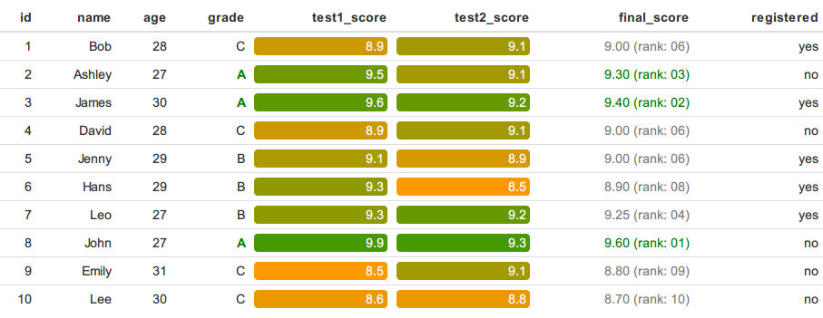

# formattable

<!-- badges: start -->
[](https://github.com/renkun-ken/formattable/actions)
[](https://codecov.io/github/renkun-ken/formattable?branch=master)
[](https://cran.r-project.org/package=formattable)
<!-- badges: end -->

This package is designed for applying formatting on vectors and data frames to make data presentation easier, richer, more flexible and hopefully convey more information.

This document is also translated into [日本語](https://github.com/renkun-ken/formattable/blob/master/README.ja.md) by [@hoxo_m](https://github.com/hoxo-m), [@dichika](https://github.com/dichika) and [@teramonagi](https://github.com/teramonagi).

## Install

The package is available on both GitHub and CRAN.

Install from GitHub:

```r
# install.packages("devtools")
devtools::install_github("renkun-ken/formattable")
```

Install from CRAN:

```r
install.packages("formattable")
```

## Introduction

Atomic vectors are basic units to store data. Some data can be read more easily with formatting. A numeric vector, for example, stores a group of percentage numbers yet still shows in the form of typical floating numbers. This package provides functions to create data structures with predefined formatting rules so that these objects store the original data but are printed with formatting.

The package provides several typical formattable objects such as `percent`, `comma`, `currency`, `accounting` and `scientific`. These objects are essentially numeric vectors with pre-defined formatting rules and parameters. For example,

```{r}
library(formattable)
p <- percent(c(0.1, 0.02, 0.03, 0.12))
p
```

The percent vector is no different from a numeric vector but has a percentage representation as being
printed. It works with arithmetic operations and common functions and preserves its formatting.

```{r}
p + 0.05
max(p)
```

```{r}
balance <- accounting(c(1000, 500, 200, -150, 0, 1200))
balance
balance + 1000
```

These functions are special cases of what `formattable()` can do. `formattable()` applies highly customizable formatting to objects of a wide range of classes like `numeric`, `logical`, `factor`, `Date`, `data.frame`, etc. A typical data frame may look more friendly with `formattable` column vectors. For example,

```{r}
p <- data.frame(
  id = c(1, 2, 3, 4, 5), 
  name = c("A1", "A2", "B1", "B2", "C1"),
  balance = accounting(c(52500, 36150, 25000, 18300, 7600), format = "d"),
  growth = percent(c(0.3, 0.3, 0.1, 0.15, 0.15), format = "d"),
  ready = formattable(c(TRUE, TRUE, FALSE, FALSE, TRUE), "yes", "no"))
p
```

## Formatting tables in dynamic document

In a typical workflow of dynamic document production, [knitr](https://yihui.org/knitr/) and [rmarkdown](https://rmarkdown.rstudio.com/) are powerful tools to render documents with R code to different types of portable documents.

knitr is able to render an RMarkdown document (markdown document with R code chunks) to Markdown document. rmarkdown calls [pandoc](https://johnmacfarlane.net/pandoc) to render a markdown document to HTML web page. To put a table (`data.frame` in R) on the page, one may call `knitr::kable` to produce its markdown representation. By default the resulted table is in a plain theme with no additional formatting. However, in some cases, additional formatting may help clarify the information and make contrast of the data. This package provides functions to produce formatted tables in dynamic documents.

```{r}
df <- data.frame(
  id = 1:10,
  name = c("Bob", "Ashley", "James", "David", "Jenny", 
    "Hans", "Leo", "John", "Emily", "Lee"), 
  age = c(28, 27, 30, 28, 29, 29, 27, 27, 31, 30),
  grade = c("C", "A", "A", "C", "B", "B", "B", "A", "C", "C"),
  test1_score = c(8.9, 9.5, 9.6, 8.9, 9.1, 9.3, 9.3, 9.9, 8.5, 8.6),
  test2_score = c(9.1, 9.1, 9.2, 9.1, 8.9, 8.5, 9.2, 9.3, 9.1, 8.8),
  final_score = c(9, 9.3, 9.4, 9, 9, 8.9, 9.25, 9.6, 8.8, 8.7),
  registered = c(TRUE, FALSE, TRUE, FALSE, TRUE, TRUE, TRUE, FALSE, FALSE, FALSE),
  stringsAsFactors = FALSE)
```

Plain table:

```{r,echo=FALSE,message=FALSE,results='asis'}
knitr::kable(df)
```

Formatted table with the following visualizations:

* Ages are rendered in gradient.
* All A grades are displayed in green bold.
* `test1_score` and `test2_score` are indicated by horizontal bars and are background-colorized: white (low score) to pink (high score)
* `final_score` shows score and ranking. Top 3 are green, and others are gray.
* `registered` texts are transformed to an icon and yes/no text.

```{r, eval=FALSE}
library(formattable)

formattable(df, list(
  age = color_tile("white", "orange"),
  grade = formatter("span", style = x ~ ifelse(x == "A", 
    style(color = "green", font.weight = "bold"), NA)),
  area(col = c(test1_score, test2_score)) ~ normalize_bar("pink", 0.2),
  final_score = formatter("span",
    style = x ~ style(color = ifelse(rank(-x) <= 3, "green", "gray")),
    x ~ sprintf("%.2f (rank: %02d)", x, rank(-x))),
  registered = formatter("span",
    style = x ~ style(color = ifelse(x, "green", "red")),
    x ~ icontext(ifelse(x, "ok", "remove"), ifelse(x, "Yes", "No")))
))
```



**The icon set used in the table is by [GLYPHICONS.com](https://GLYPHICONS.com) and included in [Bootstrap](https://getbootstrap.com/docs/3.4/components/#glyphicons).**

## `htmlwidget` conversion in interactive environments

`formattable` will automatically convert to an `htmlwidget` when in an `interactive()` context such as the console or RStudio IDE.  If you would like to avoid this conversion and see the `html` table output, please use `format_table` that calls `knitr::kable` with formatters or call `format` with the `formattable data.frame` object.

## License

This package is under [MIT License](https://opensource.org/licenses/MIT).
